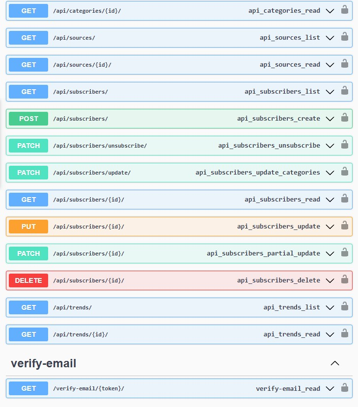
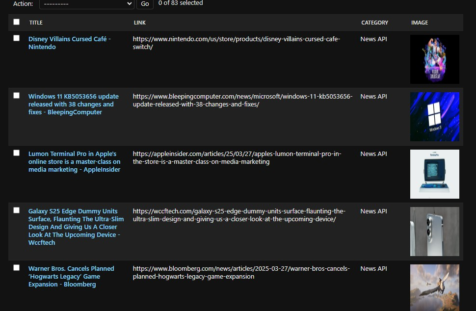
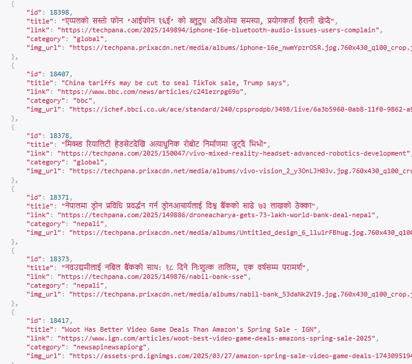

# tech_trends

<p align="center">
  
</p>

<p align="center">
  <a href="https://github.com/kushal1o1/tech_trends/stargazers"></a>
  <a href="https://github.com/kushal1o1/tech_trends/network/members"></a>
  <a href="https://github.com/kushal1o1/tech_trends/pulls"></a>
  <a href="https://github.com/kushal1o1/tech_trends/issues"></a>
  <a href="https://github.com/kushal1o1/tech_trends/graphs/contributors"></a>
</p>

<p align="center">
  <b>Backend for techTrendsFrontend</b>
</p>

<p align="center">
  <a href="#features">Features</a> •
  <a href="#demo">Demo</a> •
  <a href="#installation">Installation</a> •
  <a href="#usage">Usage</a> •
  <a href="#configuration">Configuration</a> •
  <a href="#api-reference">API Reference</a> •
  <a href="#documentation">Documentation</a> •
  <a href="#roadmap">Roadmap</a> •
  <a href="#contributing">Contributing</a> •
  <a href="#license">License</a> •
  <a href="#contact">Contact</a> •
  <a href="#acknowledgments">Acknowledgments</a>
</p>


## Overview

This project is a Django-based API for scraping and updating tech news trends. It uses Celery for asynchronous task management, Redis as a message broker, and a custom scraper to fetch the latest tech news.

## Features

- **Tech News Scraping: Automatically fetches and updates the latest tech news trends.**
- **elery Integration: Handles asynchronous tasks for updating trends every 5 minutes.**
- **Redis: Used as a message broker for Celery tasks.**
- **Django REST Framework: Provides endpoints to access the latest tech trends.**
- **Direct Message :Mail Sending to user  from admin pannel**
- **Schedule Task:Subscriber and preferences to send Emails using the Gmail API and Schedule time using Django-celery beat**
- **Clear Documentation:Api documentation USING SWAGGER drf-yasg**
- **Daily News:Create a Celery task to send the email to the subscriber with the news of the day**


## Demo

<p align="center">
  
</p>

## Screenshot




## Installation
```bash
# Clone the repository
git clone https://github.com/kushal1o1/tech_trends.git

# Navigate to the project directory
cd tech_trends

# or
pip install -r requirements.txt
```

### Prerequisites
- **Python**
- **django**
- **celery**
- **cors header**
- **drf**
- **redis**
- **request**
- **beautifulsoup**
- **ntscraper**

## Usage

```javascript
python manage.py runserver 
redis-server
celery -A tech_trends beat --loglevel=info
celery -A tech_trends worker --pool=solo -l info
```

## Configuration

### Configuration File

Create a `config.json` file in the root directory with the following structure:

```json
nth
```

### Environment Variables

| Variable | Description | Default |
|----------|-------------|---------|
| `SECRET_KEY` | Secret key for django | `Putany` |
| `DEBUG` | Bool | `True` |
| `url` | Url for news | `sth` |
| `nepali_tech_url` | sth | `sth` |
| `cors_allowed_host` | cors host | `https://localhost:3001` |
| `EMAIL_USE_TLS` | emailtls | `True` |
| `EMAIL_HOST` | host | `smtp.gmail.com` |
| `EMAIL_HOST_USER` | hostuser | `put yours` |
| `EMAIL_HOST_PASSWORD` | password | `put yours` |
| `EMAIL_PORT` | port | `587` |
| `global_tech_url,tech_crunch_url,bbc_url,NEWS_API_KEY_NEWSAPIORG` | And so on used in this projects | `use yours` |

## Directory Structure

```
d:/Refactor/tech_trends/
├─] .env (ignored)
├── .gitignore
├─] check.py (ignored)
├─] db.sqlite3 (ignored)
├── dump.rdb
├── mailApp/
│   ├── admin.py
│   ├── apps.py
│   ├── migrations/
│   │   ├── __init__.py
│   │   └── __pycache__/
│   ├── models.py
│   ├── serializers.py
│   ├── service.py
│   ├── signals.py
│   ├── static/
│   │   └── images/
│   │       └── TechTrendsLogo.png
│   ├── tasks.py
│   ├── templates/
│   │   └── emails/
│   │       ├── base.html
│   │       ├── confirmEmail.html
│   │       ├── notification.html
│   │       └── TechTrendsNews.html
│   ├── tests.py
│   ├── views.py
│   ├── __init__.py
│   └── __pycache__/
├── manage.py
├── README.md
├── requirements.txt
├── staticfiles/
├── tech_trends/
│   ├── asgi.py
│   ├── celery.py
│   ├── settings.py
│   ├── urls.py
│   ├── wsgi.py
│   ├── __init__.py
│   └── __pycache__/
├── TODO.py
└── trends/
    ├── admin.py
    ├── apps.py
    ├── migrations/
    │   ├── __init__.py
    │   └── __pycache__/
    ├── models.py
    ├── scraper.py
    ├── serializers.py
    ├─] service.py (ignored)
    ├── tasks.py
    ├── tests.py
    ├── urls.py
    ├── views.py
    ├── __init__.py
    └── __pycache__/
```

## Technologies Used

<p align="center">


 <br>


</p>

## Contributing

Contributions are what make the open source community such an amazing place to learn, inspire, and create. Any contributions you make are **greatly appreciated**.

1. Fork the Project
2. Create your Feature Branch (`git checkout -b feature/AmazingFeature`)
3. Commit your Changes (`git commit -m 'Add some AmazingFeature'`)
4. Push to the Branch (`git push origin feature/AmazingFeature`)
5. Open a Pull Request

Please make sure to update tests as appropriate and adhere to the [code of conduct](CODE_OF_CONDUCT.md).

## License

This project is licensed under the MIT License.

## Contact

Your Name - [@kushal1o1](https://twitter.com/your_twitter) - share.kusal@gmail.com

---

<p align="center">
  Made with ❤️ by <a href="https://github.com/kushal1o1/MDFileCreator">MdCreator</a>
</p>